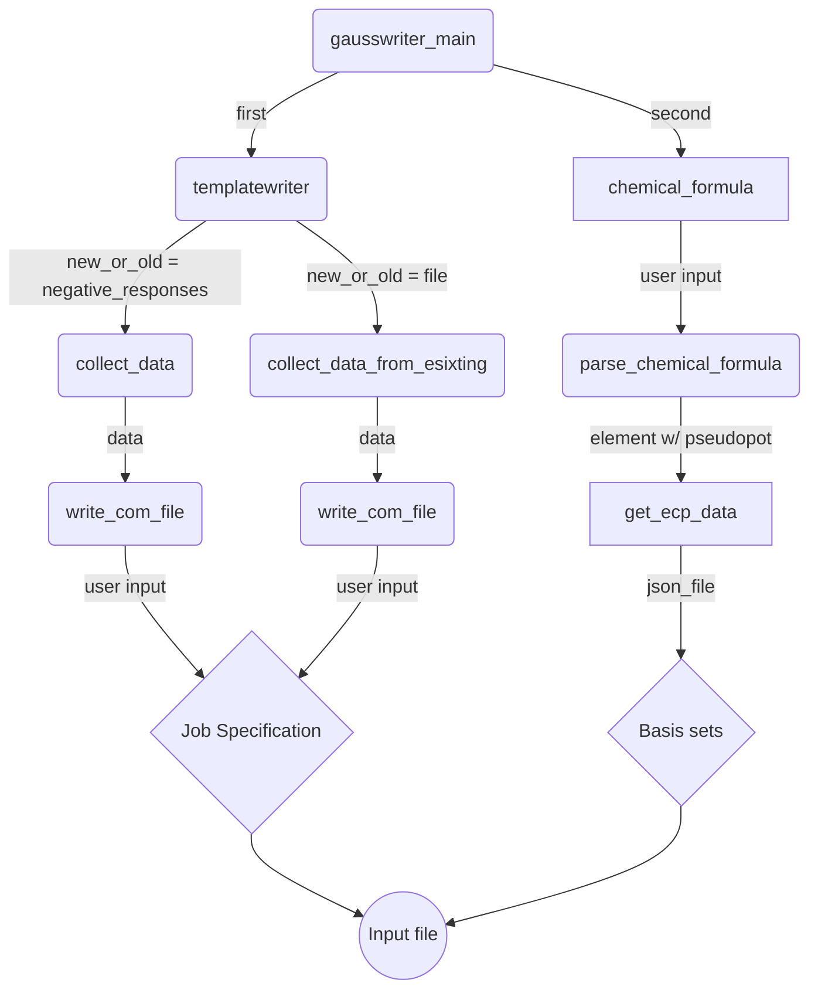

```mermaid
flowchart TD
    A(gausswriter_main) -->|first| B(templatewriter)
    B -->|new_or_old = negative_responses| C(collect_data)
    B -->|new_or_old = file| D(collect_data_from_esixting)
    C --> |data| E(write_com_file)
    D --> |data| F(write_com_file)
    E --> |user input| G{Job Specification}
    F --> |user input| G{Job Specification}
    
    A(gausswriter_main) --> |second| H[chemical_formula]
    H --> |user input| I(parse_chemical_formula)
    I --> |element w/ pseudopot| J[get_ecp_data]
    J --> |json_file| K{Basis sets}

    G --> L((Input file))
    K --> L
```